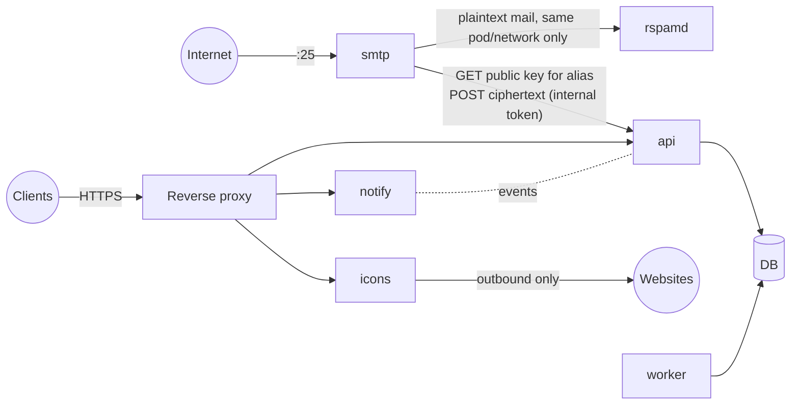

# rizzy-vault — Server Architecture & Deployment

> Status: **proposal** (M0 decision). Pairs with [`ROADMAP.md`](ROADMAP.md).

## 1. Verdict: modular monolith, one binary, multiple roles

We do **not** start with microservices. We build a **modular monolith**: one Rust binary, split inside into strict modules, that can run as **several containers, each in a different role**, when that is worth it.

```
rizzy-vault serve --roles all            # personal: one container does everything
rizzy-vault serve --roles api,notify     # scaled: each container runs only some roles
rizzy-vault serve --roles smtp
```

Why microservices from day one would be wrong here:

| Microservices cost | Why it hurts *this* project |
|---|---|
| Many containers to run | Personal self-hosters run this on a Raspberry Pi or a €5 VPS. One container is the feature. |
| Network between services | Every hop needs auth, TLS, retries and timeouts. More attack surface in a **password manager**. |
| Distributed data | Sync needs consistency across account, devices, ops and keys. Splitting the DB per service makes that a distributed-transactions problem. |
| Versioning N APIs | Internal APIs need compatibility across rolling upgrades. That's a lot of work for a small team. |
| Debugging | Tracing across services before there is even a product. |

Microservices mostly fix an **org** problem (many teams shipping on their own), not a technical one. We don't have that problem. What we do have are a few **security and ops boundaries**, and roles handle those.

## 2. Roles: the only boundaries that earn a separate process

A role is a module that *can* run in its own container. We split a role out only for a concrete reason: a different security domain, a different network exposure, or proven scaling needs.

| Role | Responsibility | Exposed to | DB access | Why it may be separate | Milestone |
|---|---|---|---|---|---|
| `api` | Auth (OPAQUE), vault/sync API, shares, admin API, alias management | Reverse proxy (HTTPS) | Read/write | Core of the system | M1 |
| `web` | Static web vault + share-recipient page | Reverse proxy | None | Can be served by any static host or CDN instead | M1 (embedded in `api`) |
| `notify` | WebSocket/SSE fan-out: "vault changed", "new mail", relay delivery pings | Reverse proxy | Read-only (or none, events only) | Many long-lived connections; scales differently from request/response traffic | M3 |
| `worker` | Background jobs: trash purge, relay-op TTL expiry (M4), share expiry (M5), mail retention (M6), op-log compaction | Nothing | Read/write | Must run as a single leader; keeps slow jobs off request paths | M1 (in-process) |
| `smtp` | Receive-only SMTP, MIME parsing, spam check, **encrypt with recipient public key**, hand ciphertext to `api` | Internet, port 25 | **None** | Parses hostile input from the whole internet. Isolated so a parser exploit cannot reach the database or any vault | M6 |
| `icons` | Fetch website favicons anonymously, cache them | Reverse proxy; outbound internet only | **None** | Fetching arbitrary URLs = SSRF risk. Runs on its own network with no route to internal services | M3 |

External (third-party) containers, all optional except the DB for team setups:

| Component | Used when |
|---|---|
| PostgreSQL | Team/SMB profile (SQLite covers personal) |
| rspamd | Mail enabled (M6) |
| Reverse proxy (Caddy / Traefik / nginx) | Always; user-provided, we ship example configs. Caddy recommended for auto-TLS |

### 2.1 Key security property: `smtp` never touches the vault



`smtp` can only (1) look up an alias's public key and (2) submit encrypted messages through a narrow internal endpoint. A full compromise of `smtp` leaks mail that arrives *while* it is compromised. It does not leak any stored mail, vault data or accounts. That boundary is the real justification for splitting, not "microservices".

## 3. Code structure (the "modular" in modular monolith)

Cargo workspace. Module boundaries are enforced by crate dependencies, not by discipline.

```
crates/
  core/            # crypto, envelope formats, item models. No I/O. Also compiled to wasm + UniFFI for clients
  sync/            # op log, HLC, version vectors, merge. Shared by clients and server
  domain-auth/     # accounts, OPAQUE, sessions, devices
  domain-vault/    # vaults, items (ciphertext), server-mode storage
  domain-relay/    # on-device mode relay + TTL (M4)
  domain-share/    # public shares (M5)
  domain-mail/     # aliases, mailbox ciphertext storage (M6)
  domain-org/      # orgs, policies (M9/M10)
  storage/         # Storage traits + sqlite and postgres impls (sqlx)
  bus/             # Event bus trait: in-process channel | Postgres LISTEN/NOTIFY | (later) NATS
  smtp-ingress/    # SMTP listener + MIME + encrypt; depends on core, NOT on storage
  icon-proxy/
  server/          # the binary: config, role wiring, HTTP (axum)
  cli/             # user CLI `rv`
```

Rules:
- Domain crates talk to each other through their public Rust APIs, never through each other's tables.
- Each domain owns its tables (prefix per domain). No cross-domain SQL joins. If we ever *must* split a domain out, its data is already separable.
- `smtp-ingress` and `icon-proxy` must not depend on `storage`. CI checks this with `cargo deny`/a dependency lint.
- Cross-role communication:
  - **In-process** (`--roles all`): direct function calls plus an in-memory event channel.
  - **Split**: internal HTTP (JSON) with a per-role token over a private network. Events go over Postgres `LISTEN/NOTIFY`, so there is no extra broker to run. NATS is a *Could* for M10, and only if metrics show we need it.

## 4. Deployment profiles

| Profile | Audience | Containers | DB | Milestone |
|---|---|---|---|---|
| **A: Solo** | Personal | 1 × `rizzy-vault --roles all` (+ your reverse proxy) | SQLite on a volume | M1 |
| **B: Solo + mail** | Personal / enthusiasts | `core` (`api,web,notify,worker,icons`), `smtp`, `rspamd` | SQLite | M6 |
| **C: Team** | Families / SMB | `api` ×N, `notify` ×N, `worker` ×1 (leader via DB advisory lock), `smtp` ×N, `icons`, `rspamd`, PostgreSQL | PostgreSQL | M9–M10 |
| **D: Kubernetes** | SMB with k8s | Same as C via Helm chart | Managed Postgres | M10 (Could) |

Every profile uses the **same image**. Roles are chosen by flags or env. No per-service images to build, sign and version-match.

## 5. Docker & Podman

We ship **OCI images**, which run unmodified on both Docker and Podman. The rules below keep both working.

### 5.1 Image

| Pri | Item |
|---|---|
| M | Static musl binary on `distroless/static` (or `scratch`): no shell, no package manager |
| M | Multi-arch: `linux/amd64` + `linux/arm64` (Raspberry Pi and ARM VPS are prime personal targets) |
| M | Runs as non-root UID, works with a read-only root filesystem, only `/data` writable |
| M | Built-in `rizzy-vault healthcheck` subcommand (no `curl` in distroless); `/healthz` + `/readyz` endpoints |
| M | Secrets via files (`*_FILE` env convention), compatible with Docker secrets and Podman secrets. No secrets in plain env by default |
| S | Signed images (cosign/sigstore), SBOM (syft) and build provenance attached to each release |
| S | Published to GHCR; tags `x.y.z`, `x.y`, `latest`, plus immutable digests in docs |

### 5.2 Compose (Docker *and* Podman)

| Pri | Item |
|---|---|
| M | One `compose.yaml` per profile (A, B, C) that works with both `docker compose` and `podman compose` |
| M | Avoid Docker-only features: no `docker.sock` mounts, no Swarm `deploy:` keys we depend on, named volumes only |
| M | Separate networks: `public` (proxy ↔ api/notify/icons), `internal` (api/worker ↔ db, smtp → api), `mail` (smtp ↔ rspamd), `egress` (icons only) |
| M | Document SELinux volume labels (`:Z`) for Fedora/RHEL hosts |

### 5.3 Podman-native

| Pri | Item |
|---|---|
| M | **Rootless first.** All profiles tested under rootless Podman |
| S | **Quadlet** unit files (`.container`, `.network`, `.volume`) so systemd manages the service: auto-start, restart, journald logs. This is the proper Podman way, better than podman-compose for servers |
| S | `podman auto-update` label support for opt-in automatic image updates |
| C | Kubernetes YAML that runs with `podman kube play` and later becomes the base of the Helm chart |
| M | Document port 25 in rootless mode: host `net.ipv4.ip_unprivileged_port_start=25`, or publish host 25 → container 2525 |

### 5.4 CI matrix

Integration tests for profiles A and B run on **both** Docker and rootless Podman in CI. "Should work on Podman" without a test means it doesn't.

## 6. When do we split further?

Only when **at least one** is true, and the data proves it:
1. A role needs to scale on its own and metrics show it is the bottleneck.
2. A component is in a different security domain (like `smtp` and `icons`).
3. A separate team owns it end to end (M10+, if ever).

"It feels cleaner" is not on the list.

## 7. Open questions

- Internal transport for split roles: plain HTTP+JSON (simple, recommended) or gRPC (typed, but adds tooling). Decide when profile B is built (M6).
- Should `web` stay embedded in the binary (one artifact, simplest), or ship as a separate static bundle for CDN hosting? Default: embedded, with an optional export.
- Leader election for `worker` in profile C: Postgres advisory lock (recommended) vs. external lock service.
